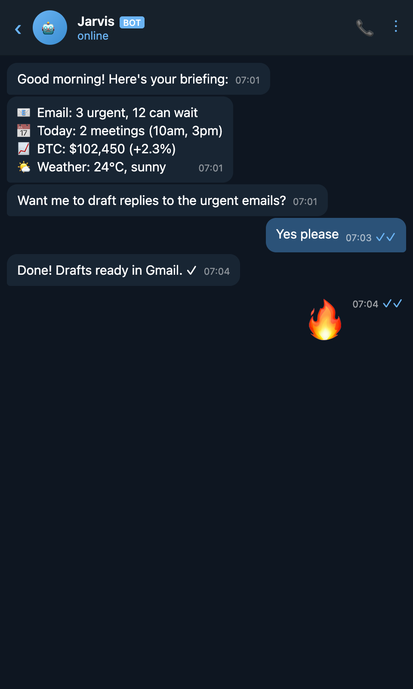

# Telegram Screenshot Generator 📱

Generate realistic Telegram-style chat screenshots from JSON. Perfect for mockups, demos, and content creation.



## Features

- 🌙 Dark and light theme support
- 🤖 Bot badges
- ✓✓ Read receipts
- 😀 Emoji-only message styling
- 🎨 Customizable avatars
- 📏 Auto-sizing or fixed dimensions

## Installation

```bash
npm install -g telegram-screenshot
# or
npx telegram-screenshot --demo
```

## Usage

### CLI

```bash
# Generate from config file
tg-screenshot config.json output.png

# Pipe JSON
echo '{"chatName":"Bot","messages":[{"text":"Hello!","incoming":true}]}' | tg-screenshot - out.png

# Demo screenshot
tg-screenshot --demo
```

### Config Format

```json
{
  "chatName": "Jarvis",
  "status": "online",
  "isBot": true,
  "avatarEmoji": "🤖",
  "theme": "dark",
  "width": 480,
  "scale": 2,
  "messages": [
    { 
      "text": "Hello!", 
      "incoming": true, 
      "time": "09:41",
      "sender": "Jarvis"
    },
    { 
      "text": "Hi there", 
      "incoming": false, 
      "time": "09:42", 
      "read": true 
    }
  ]
}
```

### Config Options

| Option | Type | Default | Description |
|--------|------|---------|-------------|
| `chatName` | string | "Chat" | Name shown in header |
| `status` | string | "online" | Status text under name |
| `isBot` | boolean | false | Show BOT badge |
| `avatarEmoji` | string | - | Emoji for avatar |
| `avatarUrl` | string | - | Image URL for avatar |
| `theme` | string | "dark" | "dark" or "light" |
| `width` | number | 480 | Viewport width |
| `height` | number | auto | Viewport height |
| `scale` | number | 2 | Device scale factor (retina) |
| `fullPage` | boolean | false | Capture full page |

### Message Options

| Option | Type | Description |
|--------|------|-------------|
| `text` | string | Message content |
| `incoming` | boolean | true = received, false = sent |
| `time` | string | Timestamp to display |
| `read` | boolean | Show double checkmarks (sent only) |
| `sender` | string | Sender name (group chats) |

### Programmatic Usage

```javascript
const { generateScreenshot } = require('telegram-screenshot');

await generateScreenshot({
  chatName: "Jarvis",
  isBot: true,
  messages: [
    { text: "Hello!", incoming: true, time: "09:41" }
  ]
}, 'output.png');
```

## Examples

### Morning Briefing Bot

```json
{
  "chatName": "Jarvis",
  "isBot": true,
  "avatarEmoji": "🤖",
  "messages": [
    { "text": "Good morning! ☀️", "incoming": true, "time": "07:00" },
    { "text": "📧 3 urgent emails\n📅 2 meetings today\n📈 BTC +2.3%", "incoming": true, "time": "07:00" }
  ]
}
```

### Light Theme

```json
{
  "chatName": "Support",
  "theme": "light",
  "messages": [
    { "text": "How can I help?", "incoming": true, "time": "14:30" }
  ]
}
```

## Requirements

- Node.js 16+
- Puppeteer (installed automatically)

## License

MIT
